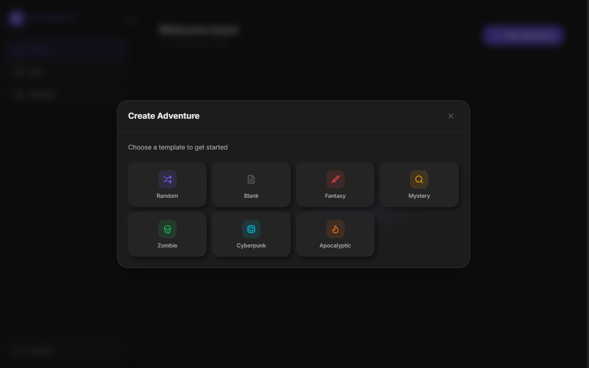
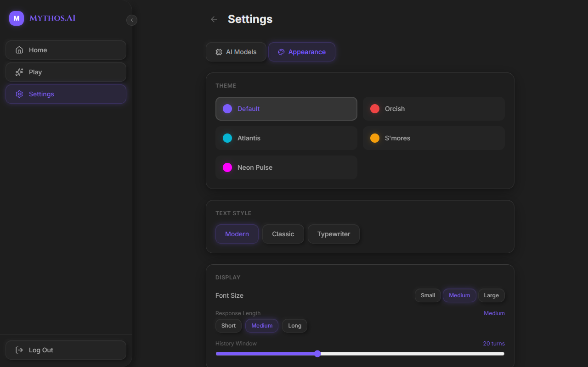
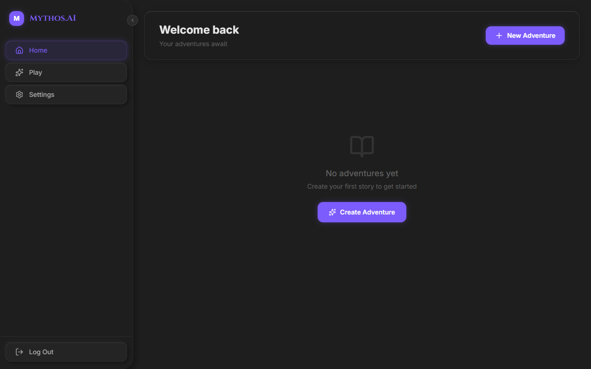

# Mythos.AI

An AI-powered interactive fiction adventure game. Create rich, branching narratives driven by local LLMs through LM Studio. Built as a native Windows desktop app with a neumorphic glassmorphism UI.

## What is Mythos.AI?

Mythos.AI is an AI Dungeon-style experience that runs entirely on your machine. Connect it to any OpenAI-compatible local LLM (via LM Studio, Ollama, etc.) and dive into procedurally narrated adventures across any genre. The AI adapts to your choices in real-time, generating immersive second-person prose while automatically building a living world around you.

## Features

### Scenario Creator
Choose from curated genre templates (Fantasy, Mystery, Zombie, Cyberpunk, Apocalyptic) that come pre-loaded with settings, plot data, and starter story cards -- or let the AI generate a completely random scenario from scratch. You can also start from a blank canvas and build your own world from the ground up.

### Adaptive Story Cards
Story cards are the backbone of world-building in Mythos.AI. They store information about characters, locations, factions, items, events, and lore -- injected into the AI's context automatically when their trigger keywords appear in the narrative. You start with a few preset cards, and the AI generates new ones as the story progresses, detecting when significant new characters, locations, or factions are introduced.

### Interactive Gameplay
Four input modes let you interact with the story in different ways:
- **Do** -- Take actions in the world
- **Say** -- Speak as your character
- **Story** -- Write narrative directly
- **See** -- Observe and examine your surroundings

The AI responds with streaming prose, building on your choices with vivid, contextual narrative.

### In-Game Settings Sidebar
Tweak your adventure on the fly without leaving the game. The right-side panel gives you access to:
- **Plot** -- AI instructions, plot essentials, author's note, story summary
- **Story Cards** -- Browse, edit, toggle, or add new cards mid-game
- **AI Models** -- Switch models, adjust temperature, context length
- **Appearance** -- Change themes, text styles, response length

### 5 Themes
Customize the look with five distinct accent themes, all built on a dark neumorphic base:

- **Default** -- Purple accent
- **Orcish** -- Red accent
- **Atlantis** -- Cyan accent
- **S'mores** -- Amber accent
- **Neon Pulse** -- Synthwave magenta with glow effects

### Dashboard
Manage all your adventures from the home screen. Resume any story with a click, duplicate scenarios to try different paths, or start fresh.

## Tech Stack

- **Frontend**: React 19 + TypeScript + Tailwind CSS v4
- **Desktop**: Tauri v2 (native Windows app)
- **State**: Zustand with localStorage persistence
- **AI**: OpenAI-compatible API (LM Studio, Ollama, etc.)
- **Design**: Neumorphic glassmorphism with multi-layered soft shadows

## Installation

> Coming soon

## License

MIT
